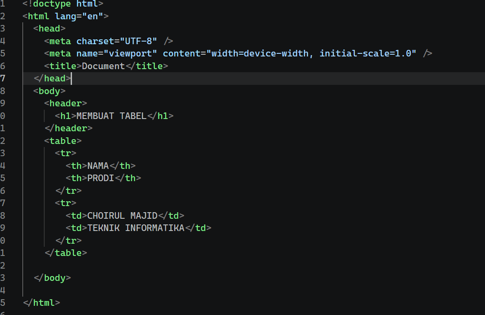
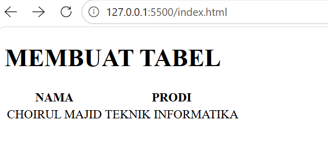
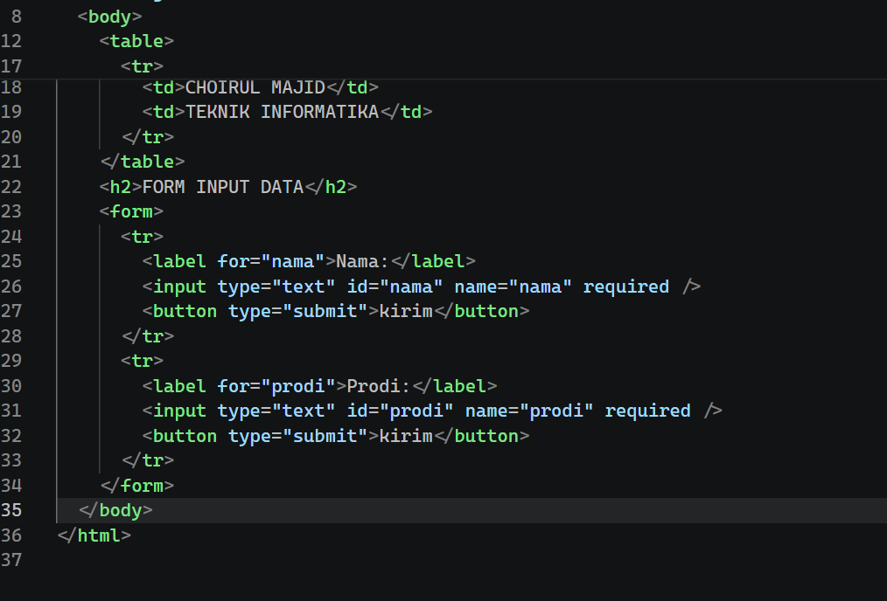
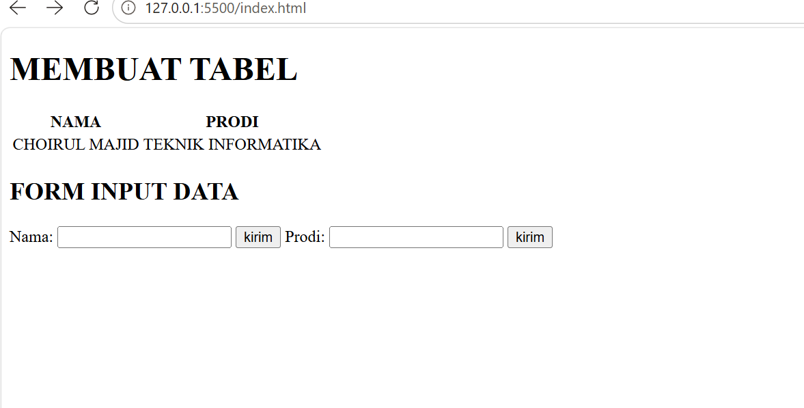
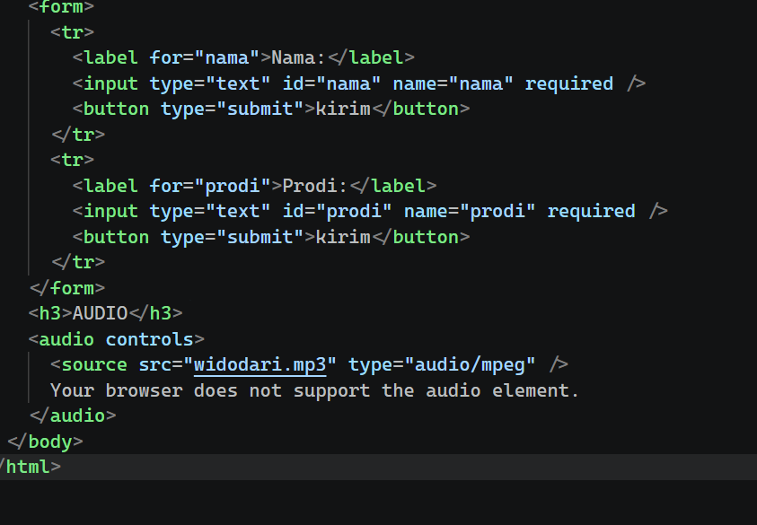
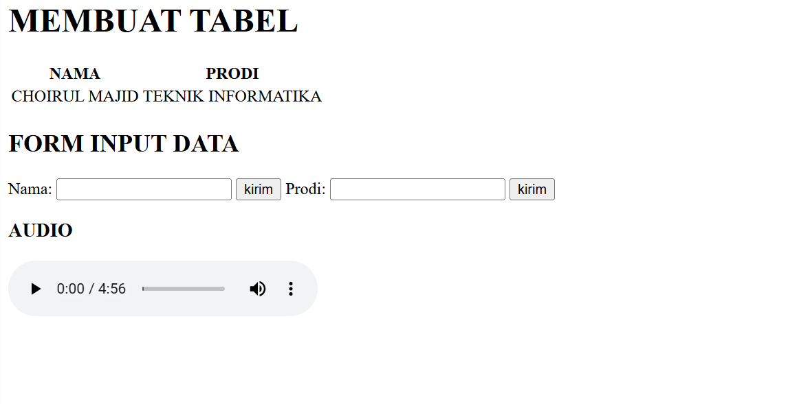
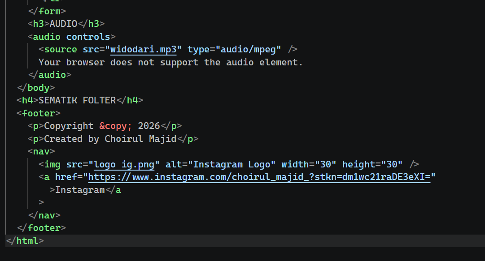
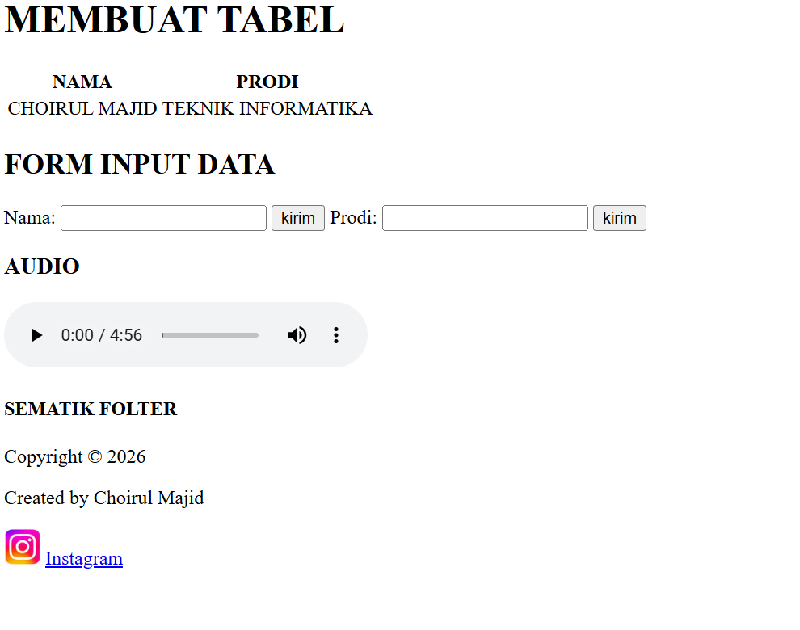
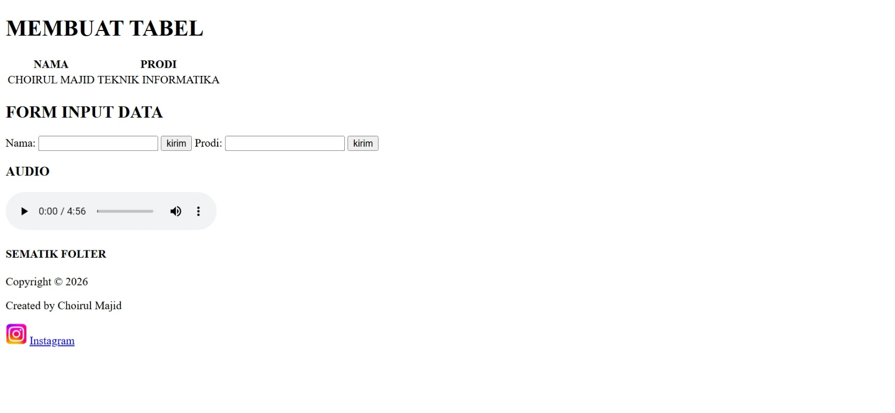

# table
BELAJAR WEB
# Lab2Web - Praktikum 2 Pemrograman Web Dasar


## 📋 Identitas Praktikan
* **Nama:** Choirul Majid  
* **Prodi:** Teknik Informatika  

## 🛠️ Langkah-Langkah Praktikum

### 1. Inisialisasi Struktur & Elemen Semantic
Membuat file utama `index.html` dengan struktur dasar HTML5 yang valid. Komponen halaman dikelompokkan menggunakan elemen semantic seperti `<header>` untuk judul atas, `<form>` untuk input data, dan `<footer>` untuk informasi hak cipta di bagian bawah.

### 2. Pembuatan Tabel Data
Menyusun tabel informasi biodata sederhana:
* Menggunakan tag `<table>` sebagai pembungkus utama.
* Membuat baris tabel menggunakan tag `<tr>`.
* Menentukan judul kolom menggunakan tag `<th>` untuk kolom **NAMA** dan **PRODI** (teks otomatis tebal dan di tengah).
* Mengisi baris data mahasiswa menggunakan tag `<td>`.
  
  
  

### 3. Pembuatan Form Input Data dengan Validasi
Membuat formulir untuk interaksi pengguna:
* Menyusun input menggunakan tag `<form>`.
* Mengganti tag tabel (`<tr>`) di dalam form dengan struktur pembungkus blok `<div>` agar struktur dokumen HTML tetap valid (standar HTML5).
* Memasang atribut `required` pada komponen `<input>` nama dan prodi sebagai metode validasi dasar agar form tidak bisa dikirim dalam keadaan kosong.
* Menyatukan tombol aksi menjadi satu buah tombol utama `<button type="submit">Kirim</button>`.
  
  

### 4. Integrasi Komponen Multimedia
Menyisipkan fitur pemutar musik menggunakan tag `<audio>`. Dilengkapi dengan atribut `controls` untuk memunculkan tombol *Play*, *Pause*, serta pengatur volume suara bawaan dari browser.



### 5. Optimalisasi Footer & Navigasi Media Sosial
Memperluas fungsi elemen `<footer>` dengan menambahkan judul, informasi pembuat teks hak cipta, serta navigasi tautan luar (`<nav>`) yang mengarah langsung ke profil Instagram menggunakan ikon gambar `logo ig.png`.




---

---

## 📸 Hasil Tampilan Halaman Web (Screenshot)


---

## 📂 Struktur Berkas Proyek
```text
├── index.html            # File utama kode HTML dan desain CSS
├── widodari.mp3          # Berkas aset audio praktikum
├── logo ig.png           # Berkas gambar ikon media sosial Instagram
└── screenshot-utama.png   # Berkas dokumentasi gambar tampilan halaman web
```

---
*Copyright © 2026 - Choirul Majid (Lab2Web).*
